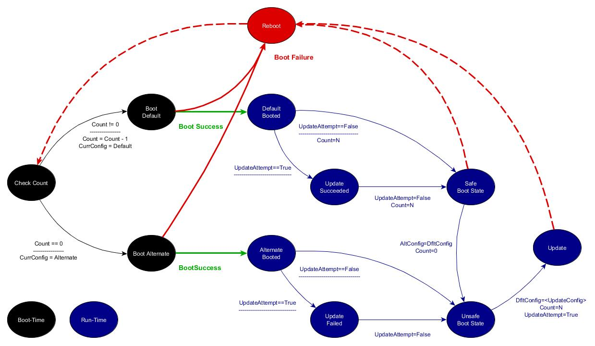
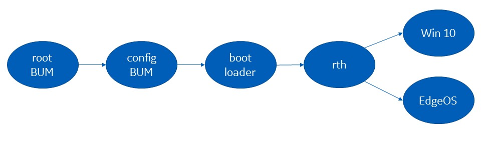
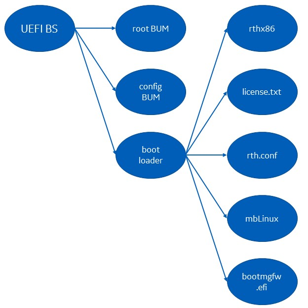

# Boot Update Manager

## Overview

The Boot-Update Manager (BUM) consists of a boot-time application for UEFI environments and a set of user-space utilities to enable an update-fallback mechanism (A/B updates). Additionally, BUM enables updates to UEFI Secure-Boot keys and logs information only available at boot time. The BUM is especially relevant for run-time environments (such as RTS-hypervised environments) that don't have access to EFI run-time services.

At boot-time, the firmware launches an EFI application (called the root BUM) from the EFI-system partition. The following tree output shows an example directory structure of the EFI-system partition (ESP) on a platform using BUM:

        |-- bootlog/
        |-- bumstate/
        |   |-- A.state
        |   |-- B.state
        |
        |-- efi/
        |   |-- boot/
        |       |-- bootx64.efi
        |
        |-- sda2/
        |   |-- bootx64.efi
        |   |-- keys/
        |   |-- payload.efi
        |
        |-- sda3/
            |-- bootx64.efi
            |-- keys/
            |-- payload.efi

The root BUM (`/efi/boot/bootx64.efi`) uses a set of state files (`/bumstate/(A/B).state`) to decide whether to boot the default boot configuration or the alternate boot configuration. The state files include a counter that is decremented on each boot attempt. While the counter is greater than zero, the root BUM attempts to boot with the default boot configuration. In the event of a successful boot, the run-time environment uses the BUM utilities to restore the counter to its' original value. If the boot repeatedly fails and the counter eventually reaches zero, the root BUM attempts to boot with the alternate boot configuration. Before each boot attempt, the root BUM marks the state file according to which configuration is being booted: default or alternate.

Generically, a boot configuration is the set of files and arguments used to boot the system (e.g. boot loader, RTS hypervisor image, configuration file, kernel image, etc ...). In the BUM context, there is a subdirectory in the EFI system partition for each boot configuration. All files required for a boot configuration are contained within the corresponding configuration directory. These subdirectories are named after the boot configuration. In the above example, the configurations are named `sda2` and `sda3`. The root BUM uses the state files to determine the default and alternate configuration names. 

Each configuration directory contains an EFI application called the configuration BUM, (`/sda2/bootx64.efi`). In terms of basic functionality, the configuration BUM is identical to the root BUM, but may be a different revision. When the root BUM launches a specific boot configuration, it launches the configuration BUM in that configuration directory. The configuration BUM launches the payload (`/sda2/payload.efi`) in the same configuration directory.
This payload can be the boot loader that launches the remainder of the boot configuration from the same configuration directory.

## Update/Fall-back State-machine

The following diagram shows the full update/fall-back state machine. 

The boot-time aspect of the state machine is described in the previous section. If the platforms boots with the default boot configuration, both boot configurations can be assumed to be valid. This state is denoted as the "Safe Boot State" in the state machine diagram. If the platform boots with the alternate boot configuration, only the alternate boot configuration is valid. This state is denoted as the "Unsafe Boot State" in the state machine diagram. Conversely, in the "Unsafe Boot State", the boot configuration used to boot the current environment is the alternate boot configuration.

An update requires more than zero time. An update can fail (the platform can loose power) between the time the update starts and before the update completes. Further, an updated boot configuration can't be assumed to be valid until that boot configuration is successfully booted. Therefore, updating a boot configuration requires placing the platform into an "Unsafe Boot State" from before starting the update until the new configuration is successfully booted.

During an update, the alternate boot configuration is the current boot configuration. When performing an update from the "Safe Boot State", the system is transitioned to the "Unsafe Boot State", the alternate boot configuration is set to the default boot configuration, and the default boot configuration is set to invalid, and the attempt-count is set to zero. These state changes must be atomic. The state files and related utilities are written to provide some confidence that state updates occur atomically. Once the update is completely written to disk, before rebooting the system, the new boot configuration is set as the default boot configuration.

## User Space Utilities

Following is the list of user-space utilities used to manipulate state information. Refer to the bash script, ` test/util-test.sh` for example usage.

        bumstate-init <state directory> <name>

            Initialize the state files `A.state` and `B.state` inside the state directory (first argument).
            Initializes the alternate boot configuration to `name` (second argument).
            Initializes the default boot configuration to an empty string. 
            Initializes the current boot configuration to alternate.
            Initializes the remaining attempt count to 0. 

        bumstate-runtime-init <state directory>

            Restores the remaining-attempt count to the full value and reports the boot status.
            - If `bumstate-update-complete` was called before the system was rebooted, and the new boot configuration is successfully booted, the utility reports `UPDATESUCCESS`.
            - If `bumstate-update-complete` was called before the system was rebooted, and the root BUM fails all attempts to boot the new configuration, the utility reports `UPDATEFAILURE`.
            - For a successful boot of the default boot configuration without updates, the utility reports `BOOTSUCCESS`.
            - Failing to boot the default boot configuration in the absence of updates, the utility reports `BOOTFAILURE`.

        bumstate-update-start <state directory>

            Sets the state files as needed before beginning an update. This utility should be called before writing the update to disk.

        bumstate-update-complete <state directory> <attempt count> <new name>

            Sets the state files as needed after an update is completely written to disk.
            
        bumstate-currconfig-get <state directory>

            Prints the name of the configuration used to boot the current environment.

        bumstate-noncurrconfig-get <state directory>

            Prints the name of the configuration other than the one used to boot the current environment.

        bumstate-print <state directory>

            Prints detailed state information.

        bumstate-boottime-test <state directory>

            Test utility that performs the same state operation as performed by the boot-time component.

### Example Utility Usage

1) State initialization during installation:

        # bumstate-init /mnt/boot/bumstate sda2

2) State query to determine which partition to update

        # updatable=`bumstate-noncurrconfig-get /mnt/boot/bumstate`
        # echo $updatable
        sda3
        #

3) State operation before initiating update

        # bumstate-update-start /mnt/boot/bumstate

4) State operation after completing update before reboot

        # bumstate-update-complete /mnt/boot/bumstate 3 sda3

5) State operation immediately after reboot after failed update

        # status=`bumstate-runtime-init /mnt/boot/bumstate`
        # echo $status
        UPDATEFAILURE
        # 

6) State operation immediately after complete successful boot after successful update

        # status=`bumstate-runtime-init /mnt/boot/bumstate`
        # echo $status
        UPDATESUCCESS
        # 

7) State query to determine current boot configuration

        # currconfig=`bumstate-currconfig-get /mnt/boot/bumstate`
        # echo $currconfig
        sda3
        #

8) State operation immediately after complete successful boot without updates

        # status=`bumstate-runtime-init /mnt/boot/bumstate`
        # echo $status
        BOOTSUCCESS
        #

## Example: RTS Hypervisor

The following example shows how the boot-update manager can be used in the broader context of an RTS-hypervised environment. Specifically, this example considers the case where Windows is running as the virtualized guest and Edge OS is running as a privileged guest. The main boot partition, including the boot-update manager, are owned by Edge OS. The disk is shared, with different partitions assigned to each guest. The partition structure is listed below:

        1.  MS Recovery:    450MB   Assigned to Windows 10
        2.  MS Boot:        100MB   Assigned to Windows 10
        3.  MS Reserved:     16MB   Assigned to Windows 10
        4.  MS Data:        740GB   Assigned to Windows 10
        5.  EdgeOS Boot:    100MB   Assigned to EdgeOS
        6.  EdgeOS root 1:  300MB   Assigned to EdgeOS
        7.  EdgeOS root 2:  300MB   Assigned to EdgeOS
        8.  EdgeOS conf:     20MB   Assigned to EdgeOS
        9.  EdgeOS Data:    240GB   Assigned to EdgeOS

The boot chain is shown below:

The complete set of boot-related files required within a configuration directory is shown below:

        bootx64.efi     Configuration BUM
        payload.efi     Boot loader
        rthx86          Hypervisor ELF binary
        license.txt     Hypervisor license file
        rth.conf        Hypervisor configuration file
        mbLinuz         Wrapped EdgeOS kernel
        bootmgfw.efi    Windows boot manager EFI binary

When enabling Secure Boot, a possible chain-of-trust for verification is shown below. The EFI applications (BUM, boot loader, etc ...) are loaded from disk using EFI boot-time services. If Secure Boot is enabled, the application binaries are verified by those same services. In this example, it is assumed that the boot loader verifies any files it loads.  

Recall, an update always overwrites the default boot configuration from the alternate boot configuration. Depending on the initial state of the system and the sequence of updates, either Edge OS root partition (1 or 2) can contain the default Edge OS. When an update is deployed, the updated root file-system may have to be written to either partition.

The root partition is indicated to the kernel through kernel command-line arguments. For a hypervised environment, the command-line arguments are specified in the hypervisor configuration file. Therefore, two possible hypervisor configuration files are needed, one for each set of command-line arguments.

Since the boot loader verifies the hypervisor-configuration file, two copies of the boot loader is needed: one for each hypervisor configuration file. All other files remain the same regardless of the EdgeOS boot partition.

Accordingly, OS-update package should contain the following list of boot-related files:

    bootx64.efi     BUM image
    payload_1.efi   boot-loader image tied to rth_1.conf
    payload_2.efi   boot-loader image tied to rth_2.conf
    rthx86          RTS hypervisor ELF binary image
    license.txt     Hypervisor license file
    rth_1.conf      RTH configuration file with arguments pointing to rootfs 1
    rth_2.conf      RTH configuration file with arguments pointing to rootfs 2
    mbLinuz         Wrapped EdgeOS kernel
    bootmgfw.efi    Windows boot manager EFI binary

## Building the Utilities

Current (temporary) build instruction for user-level utilities:

        export BUILD_TYPE=executable
        export ARCH=amd64
        bash -c build/build.sh

## Building the Boot Update Manager

## State-File Format

## Boot Update Manager Flow Chart

### root BUM

### configuration BUM
